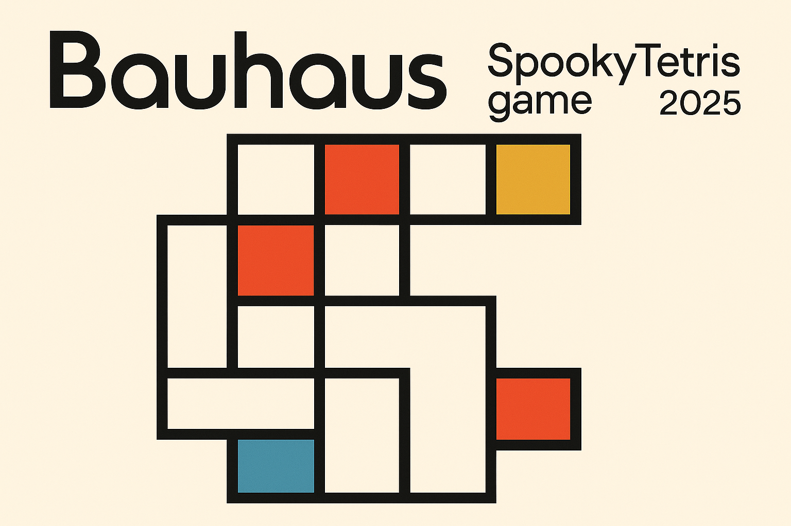
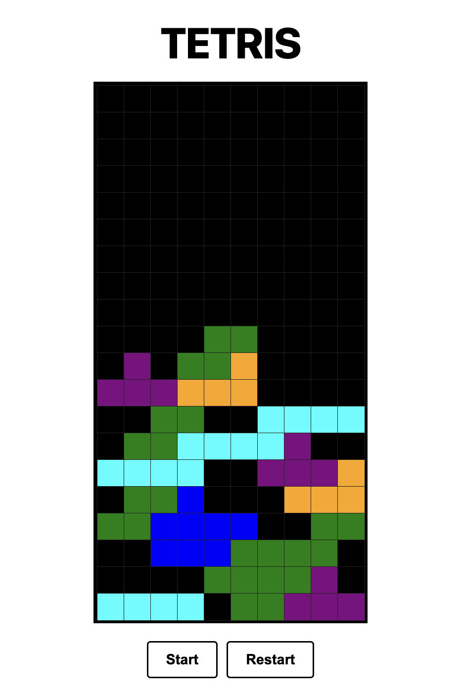
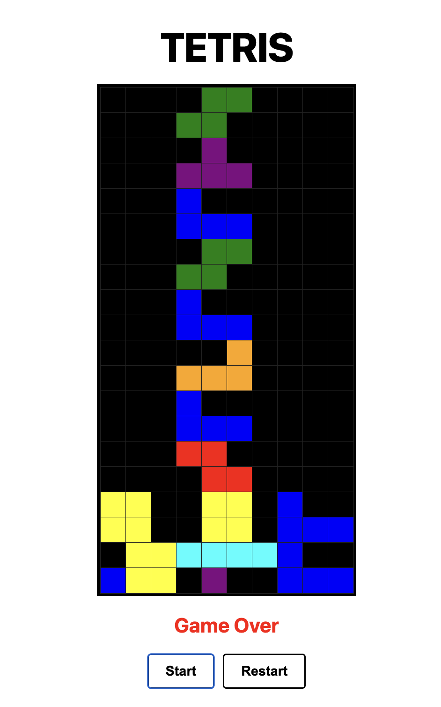

# Tetris Game 🕹️

Un clon funcional y sencillo del clásico juego Tetris, desarrollado con React y Next.js.  
Este proyecto tiene una interfaz limpia, controles por teclado y botones para iniciar y reiniciar el juego.

---

## ✨ Características
* Tablero cuadrado de 20 filas por 10 columnas.
* Piezas de colores que se mueven, rotan y caen.
* Control mediante teclado (flechas) y botones de Start y Restart.
* Diseño minimalista en blanco y negro con piezas coloridas.

---

## Capturas de pantalla

Aquí algunas imágenes del juego en acción:

  
*Tablero de Tetris en juego, mostrando las piezas y el puntaje.*

  
*Pantalla con botones de Start y Restart y game over*

## 🚀 Instalación y uso
1. Clonar el repositorio:
```bash
git clone https://github.com/spookycoincidence/tetrisgame.git
```
2. Instalar dependencias:
```bash
cd tetrisgame
npm install
```
3. Correr la app en modo desarrollo:
```bash
npm run dev
```
4. Abrir http://localhost:3000 en el navegador

## Uso
Usa las flechas del teclado para mover y rotar las piezas.

Presiona Start para iniciar el juego.

Presiona Restart para reiniciar el juego en cualquier momento.

## Scripts disponibles
* npm run dev - Inicia servidor de desarrollo
* npm run build - Construye la app para producción
* npm run start - Inicia servidor en modo producción
* npm run lint - Corre el linter para detectar errores de código

## Tecnologías
* ⚛️ Next.js 13
* 🧠 React 18
* 💜 TypeScript
* 🔒 CSS puro (sin Tailwind)

## Desarrollado con ❤️ por spookycoincidence